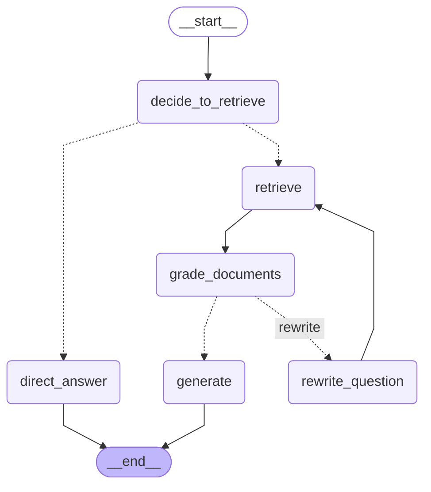

# LangGraph flowchart

Generated from `app.get_graph().draw_mermaid()`.

```mermaid
---
config:
  flowchart:
    curve: linear
---
graph TD;
	__start__([<p>__start__</p>]):::first
	decide_to_retrieve(decide_to_retrieve)
	retrieve(retrieve)
	grade_documents(grade_documents)
	rewrite_question(rewrite_question)
	generate(generate)
	direct_answer(direct_answer)
	__end__([<p>__end__</p>]):::last
	__start__ --> decide_to_retrieve;
	decide_to_retrieve -.-> direct_answer;
	decide_to_retrieve -.-> retrieve;
	grade_documents -.-> generate;
	grade_documents -. &nbsp;rewrite&nbsp; .-> rewrite_question;
	retrieve --> grade_documents;
	rewrite_question --> retrieve;
	direct_answer --> __end__;
	generate --> __end__;
	classDef default fill:#f2f0ff,line-height:1.2
	classDef first fill-opacity:0
	classDef last fill:#bfb6fc

```
